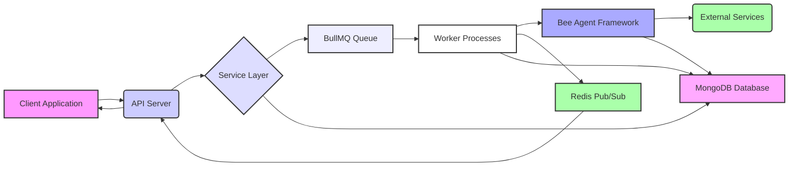
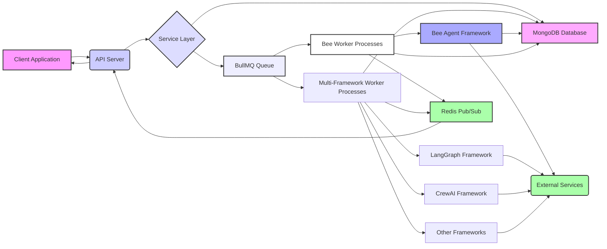

# Experimental Multi-Framework API Support

This is a PoC and proposal for supporting other AI Agents frameworks with the Bee API 
infrastructure. 

## Terminology

By multi-framework, we mean agents built using frameworks other than Bee, for example
a LangGraph or CrewAI agent. 

## Current Architecture Design

Our understanding of the current Bee APi architecture is illustrated below:



*   The **Client Application** initiates a request to the **API Server**.
*   The **API Server** handles client authentication, authorization, and request validation.
*   The validated request is then passed to the **Service Layer**.
*   The **Service Layer** is responsible for creating or updating resources, such as artifacts, tools, and files, and enqueues jobs in the **BullMQ Queue** for asynchronous processing (logic in `src/runs/runs.service.ts`)
*   **Worker Processes** pull jobs from the **BullMQ Queue**. These jobs include tasks such as:
    *   Executing agent runs.
    *   Calling tools within the Bee Agent Framework.
    *   Creating embeddings for vector databases.
    *   Performing file extractions.
*   **Worker Processes** directly interact with the **Bee Agent Framework**, which provides various tools, including:
    *   `ArXivTool` for fetching research paper abstracts.
    *   `WikipediaTool` for retrieving information from Wikipedia.
    *   `CodeInterpreterTool` for executing Python code.
    *   `FunctionTool` for using custom functions.
    *   `ApiTool` for interacting with external APIs.
    *   Other tools, such as `LLMTool`, `OpenMeteoTool`, and `CalculatorTool`.
*   The **Service Layer** does not directly interact with the **Bee Agent Framework** to initiate or manage runs, it delegates that work to the **Worker Processes**.
*   **Redis** is used by the **BullMQ Queue** for job management and as a pub/sub broker for event streaming.
*   When an event occurs (e.g., a change in a run's status, tool call output, or message creation), the **Worker Processes** publish the event to a **Redis pub/sub channel**.
*   The **API Server** subscribes to the relevant **Redis pub/sub channel** using the `subscribeAndForward` function, which is specific to the run or the thread.
*   The **API Server** receives published events from Redis and forwards them to the **Client Application** via a **Server-Sent Events (SSE) connection**.
    *   The `sse.init(res)` function sets the appropriate headers for an SSE stream.
    *   The `sse.send(res, { event: event.event, data: event.data })` function sends event data to the client.
*   The **Client Application** receives real-time updates through the established SSE connection, enabling dynamic interaction and feedback.
*   The **MongoDB Database** stores all resource data, including artifacts, tools, runs, messages, users, and projects.

## Proposed Architecture

The proposed design extends the Bee API architecture as illustrated below:



The proposed design extends the existing architecture adding new python workers for instantiating
new agents based on developers-supplied code for the frameworks of choice (e.g., LangGraph, CrewAI etc.).

### Multi-Framework Agent Registration

New agents are registered using the `create assistant` API. New types of agents have been introduced 
(`Agent.LANGGRAPH: langgraph`) - the agent type is specified in the API payload, for example:

```shell
curl -X POST http://localhost:4000/v1/assistants \
-H "Authorization: Bearer ${BEE_API_KEY:-sk-proj-testkey}" \
-H "Content-Type: application/json" \
-d '{
    "name": "Math Wizard",
    "tools": [],
    "model": "llama3.1",
    "agent": "langgraph",
    "metadata": {"code": "langgraph.math_agent.MathAgent.getGraph"}
}'
```

The `metadata.code` section in the `create assistant` API is used to provide the code module, class and
method that returns a graph to be dynamically loaded and invoked. There might be other metadata
fields that need to be provided but this is just an initial PoC.

### Multi-Framework Agent Run Creation

The usual "create thread and run" API can be used to start an Multi-Framework agent (e.g. )

```shell
curl -X POST http://localhost:4000/v1/threads/runs \
-H "Authorization: Bearer ${BEE_API_KEY:-sk-proj-testkey}" \
-H "Content-Type: application/json" \
-d '{
      "assistant_id": "asst_679fe33e71f491712dec94c7",
      "stream": "true",
      "thread": {
        "messages": [
          {"role": "user", "content": "Add 45 and 5, then divide the result by 2"}
        ]
      }
    }'
```

The `assistant_id` can be retrieved after registering the agent as in the previous step, by listing
available assistants and checking the id.

The service layer logic in `src/runs/runs.service.ts` retrieves the assistant (agent) metadata before
starting the run and enqueues the run into a new queue (`runs-lg`) different from the default queue (`runs`) 
used by the Bee workers.


### Multi-Framework Agent Run Execution

The Python code for this section is primarily derived from the **data extraction workers** and the bee-hive factory pattern. It is assumed that the required code is accessible in the worker's `$PYTHONPATH`. This approach takes advantage of the factory pattern used in bee-hive to dynamically load agents from multiple frameworks.

Workers continuously monitor the `runs-lg` queue to fetch new jobs. Once a job is picked up, the corresponding worker retrieves the run information from the MongoDB-based bee-api database. Using this run information, it selects and dynamically loads the appropriate agent code. The worker then executes the agent using the prompt obtained also from the database. Throughout this process, updates are published to a Redis pub-sub topic. These updates are received by the API server, which relays them back to the client via Server-Sent Events (SSE).


### Key Changes

The initial PoC only shows LangGraph agents, so the changes reflect that:

- Added new queue `QueueName.RUNS_LANGGRAPH: 'runs-lg'` in `src/jobs/constants.ts`
- Added new constant `Agent.LANGGRAPH: langgraph` in `src/runs/execution/constants.ts`
- Added new queue definition in `src/runs/jobs/runs-lg.queue.ts` for `QueueName.RUNS_LANGGRAPH`
- Added code in `src/runs/runs.service.ts` to enqueue to `QueueName.RUNS_LANGGRAPH` if agent is of type `Agent.LANGGRAPH`
- Added worker code (based on **data extraction workers** code) with new executor for handling starting runs for multi-framework agents in `workers/python/multi-framework`
- Added factory code (based on bee-hive factory pattern) to instantiate and run agents from different framworks `workers/python/multi-framework`

## Running the PoC

### Prereqs
- Python 3.11+ (using [virtual environments](https://packaging.python.org/en/latest/guides/installing-using-pip-and-virtual-environments/#create-and-use-virtual-environments) is reccomended)
- Node Version Manager ([nvm](https://github.com/nvm-sh/nvm?tab=readme-ov-file#installing-and-updating)) 
- [pnpm](https://pnpm.io/installation)
- [pipx](https://pipx.pypa.io/stable/installation/)
- [poetry](https://python-poetry.org/docs/)

### Cloning this fork

```shell
git clone https://github.com/pdettori/bee-api.git
cd bee-api
git checkout lg-workers
```

### Prepare runtime envs and deps

```shell
pipx install poetry
pipx ensurepath
# may need to re-open terminal and go to `bee-api` project root again
python -m venv .venv
source .venv/bin/activate 
nvm install v20.18.2
nvm use v20.18.2
cd workers/python/multi_framework
poetry install
pip install -r langgraph/requirements.txt
cp ../../../.env.example .env # edit .env to set RUN_BULLMQ_WORKERS=runs-lg and PORT=4001 and set also OPENAI_API_KEY
cd -
```

### Starting all components

#### Start Infrastructure

Follow instructions in [Starting the bee-api infrastructure](https://github.com/pdettori/bee-api?tab=readme-ov-file#starting-the-bee-api-infrastructure)

- Clone the bee-stack repository https://github.com/i-am-bee/bee-stack
- Navigate to the bee-stack directory.
- Run the infrastructure:

```
./bee-stack.sh clean
./bee-stack.sh start:infra
```

### Start API Server

- Navigate back to the bee-api repository.
- Install packages:

```shell
pnpm install
```

- When running for the first time seed the database:

```shell
pnpm mikro-orm seeder:run
```

- copy .env.example to .env

```shell
cp .env.example .env
```

- Add values the env vars: CRYPTO_CIPHER_KEY, AI_BACKEND and API key for which ever provider you have chosen.
- Use `openssl rand -base64 32` to generate CRYPTO_CIPHER_KEY
- Run the bee-api:

```shell
nvm use v20.18.2 # ensure you have the correct vesrion for python
pnpm start:dev
```

#### Start Python Workers

Open new terminal, navigate to forked project root and then:

```shell
source .venv/bin/activate
cd workers/python/multi_framework
python main.py
```

### Create assistant with sample langgraph code 

Open another terminal and run:

```shell
curl -X POST http://localhost:4000/v1/assistants \
-H "Authorization: Bearer ${BEE_API_KEY:-sk-proj-testkey}" \
-H "Content-Type: application/json" \
-d '{
    "name": "math-agent",
    "tools": [],
    "model": "llama3.1",
    "agent": "langgraph",
    "metadata": {"code": "langgraph.math_agent.MathAgent.getGraph"}
}'
```    
You should receive a json response similar to the following:

```json
{"id":"asst_67a3d44cefc39b303cc7d16e","object":"assistant","tools":[],"tool_resources":null,"instructions":null,"name":"math-agent","description":null,"metadata":{"code":"langgraph.math_agent.MathAgent.getGraph"},"created_at":1738789964,"model":"llama3.1","agent":"langgraph"}
```

Take note of the `id` value (e.g. set `ASSISTANT_ID=asst_67a3d44cefc39b303cc7d16e`)

### Start a run with LangGraph agent

The example LangGraph agent to run is located in `workers/python/multi_framework/langgraph/math_agent.py`.

Start a new thread and run with the following API call:

```shell
curl -X POST http://localhost:4000/v1/threads/runs \
-H "Authorization: Bearer ${BEE_API_KEY:-sk-proj-testkey}" \
-H "Content-Type: application/json" \
-d '{
      "assistant_id": "'${ASSISTANT_ID}'",
      "stream": "true",
      "thread": {
        "messages": [
          {"role": "user", "content": "Add 45 and 5, then divide the result by 2"}
        ]
      }
    }'
``` 

If all worked as expected, you should receive an output similar to:

```json
event: thread.run.created
data: {"id":"run_67a3d89aefc39b303cc7d17a","object":"thread.run","thread_id":"thread_67a3d89aefc39b303cc7d176","assistant_id":"asst_67a3d44cefc39b303cc7d16e","status":"queued","last_error":null,"required_action":null,"tools":[],"instructions":null,"additional_instructions":null,"metadata":{},"created_at":1738791066,"started_at":null,"expires_at":1738791666,"cancelled_at":null,"completed_at":null,"failed_at":null,"model":"llama3.1"}

event: thread.run.queued
data: {"id":"run_67a3d89aefc39b303cc7d17a","object":"thread.run","thread_id":"thread_67a3d89aefc39b303cc7d176","assistant_id":"asst_67a3d44cefc39b303cc7d16e","status":"queued","last_error":null,"required_action":null,"tools":[],"instructions":null,"additional_instructions":null,"metadata":{},"created_at":1738791066,"started_at":null,"expires_at":1738791666,"cancelled_at":null,"completed_at":null,"failed_at":null,"model":"llama3.1"}

event: thread.run.created
data: {"id":"run_67a3d89aefc39b303cc7d17a","status":"created","timestamp":"2023-10-05T14:48:00Z","initiator":"user@example.com","details":{"description":"thread run started","priority":"high","message":"Add 45 and 5, then divide the result by 2"}}

event: thread.run.completed
data: {"id":"run_67a3d89aefc39b303cc7d17a","status":"completed","timestamp":"2023-10-05T14:48:00Z","initiator":"user@example.com","details":{"description":"thread run completed","priority":"high","message":{"messages":{"content":"The result of adding 45 and 5, then dividing the result by 2, is 25.0."}}}}

event: done
data: "[DONE]"
```